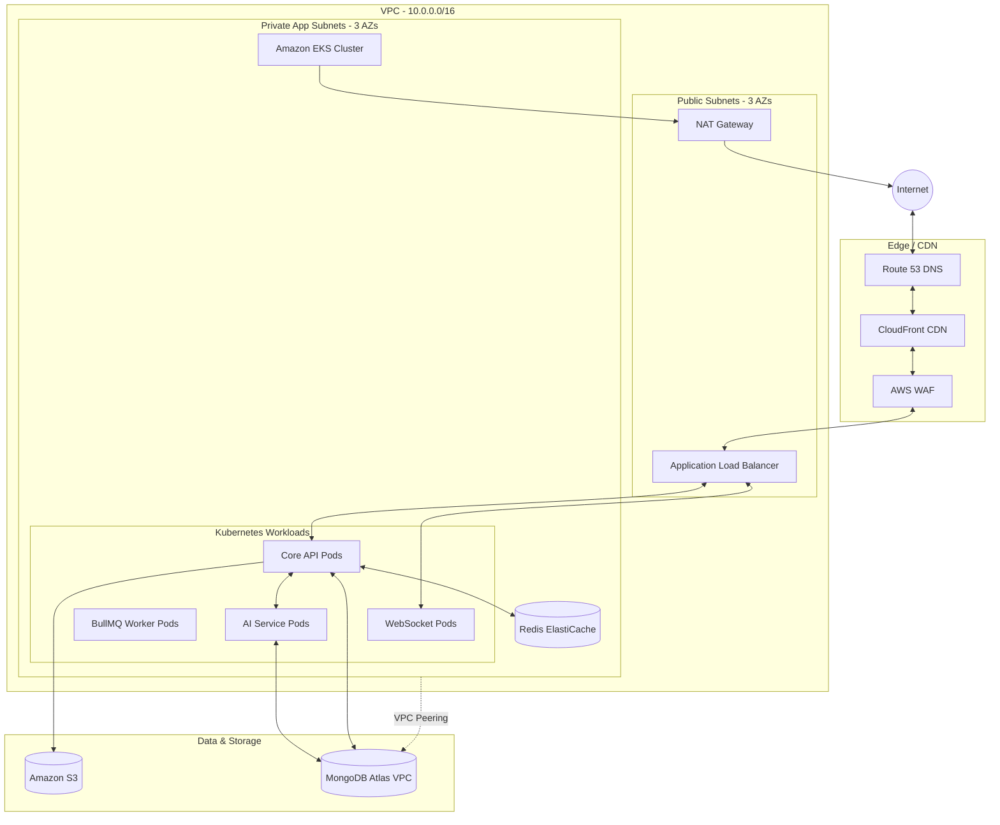

# Doc 08 — Cloud Architecture

**Document ID:** PULSE-DOC-08
**Version:** 1.0
**Status:** Draft
**Last Updated:** August 3, 2026
**Author:** Pulse Engineering Team
**Depends On:** [Doc 03 (Non-Functional Requirements)](./03_Non_Functional_Requirements.md), [Doc 04 (Architecture)](./04_System_Architecture.md)

---

## Table of Contents

1. [Cloud Strategy & Principles](#1-cloud-strategy--principles)
2. [High-Level AWS Architecture Diagram](#2-high-level-aws-architecture-diagram)
3. [Network Design (VPC & Subnets)](#3-network-design-vpc--subnets)
4. [Compute Layer (EKS & K8s)](#4-compute-layer-eks--k8s)
5. [Storage & Database Layer](#5-storage--database-layer)
6. [Security & Edge Layer](#6-security--edge-layer)
7. [Disaster Recovery (DR) & Failover](#7-disaster-recovery-dr--failover)

---

## 1. Cloud Strategy & Principles

Pulse operates as a high-availability B2B SaaS platform. Our infrastructure relies exclusively on **Amazon Web Services (AWS)** for core compute and networking, combined with **MongoDB Atlas** for database management.

### 1.1 Core Principles
- **Infrastructure as Code (IaC):** 100% of the infrastructure is provisioned using HashiCorp Terraform. ClickOps (manual changes via AWS Console) is strictly forbidden in production.
- **Multi-AZ by Default:** All critical services run across three Availability Zones (AZs) to survive datacenter failures.
- **Zero Trust Internal Network:** Microservices must authenticate with each other, and databases are completely isolated from the public internet.
- **Stateless Compute:** All containerized applications are entirely stateless. State lives exclusively in MongoDB, Redis, or S3.

---

## 2. High-Level AWS Architecture Diagram

---

## 3. Network Design (VPC & Subnets)

To ensure maximum security and isolation, the Pulse VPC (`10.0.0.0/16`) is divided into distinct subnet tiers across 3 Availability Zones (AZ-a, AZ-b, AZ-c).

| Tier | Subnet Range | Internet Access | Resources Hosted |
|---|---|---|---|
| **Public** | `10.0.1.0/24` to `.3.0/24` | Inbound & Outbound | ALBs, NAT Gateways, Bastion Hosts (if required). |
| **Private App**| `10.0.10.0/24` to `.12.0/24`| Outbound Only (via NAT) | EKS Worker Nodes (NestJS, FastAPI, BullMQ). |
| **Private Data**| `10.0.20.0/24` to `.22.0/24`| None | ElastiCache Redis, Internal Network Load Balancers. |

### 3.1 Network Security
- **Security Groups:** Resources only accept traffic from the specific Security Group of the resource that needs to access them (e.g., Redis SG only allows Inbound from EKS Worker Nodes SG on port 6379).
- **VPC Peering:** The AWS VPC is peered directly with the MongoDB Atlas VPC. Database traffic never traverses the public internet.

---

## 4. Compute Layer (EKS & K8s)

All application code runs in Docker containers managed by **Amazon Elastic Kubernetes Service (EKS)**.

### 4.1 Node Groups (EC2)
- **General Purpose:** `m6i.xlarge` instances for NestJS API pods and WebSocket gateways.
- **Worker/Job Nodes:** `c6i.xlarge` (Compute optimized) instances for heavy asynchronous processing (PDF generation, data exports).
- **Autoscaling:** Karpenter is used to automatically provision new underlying EC2 instances within seconds when Pods are pending due to resource constraints.

### 4.2 Pod Autoscaling (HPA)
Horizontal Pod Autoscalers (HPA) scale the number of replica pods based on specific metrics:
- **NestJS API:** Scales when CPU utilization > 70% or active HTTP requests > 500 per pod.
- **BullMQ Workers:** Scales based on custom Redis queue depth metrics (using KEDA).
- **WebSocket Gateway:** Scales based on memory and concurrent connection counts.

---

## 5. Storage & Database Layer

### 5.1 Object Storage (S3)
- **Bucket 1 (`pulse-assets`):** Public. Hosts static frontend assets, images, and public marketing content. Served via CloudFront.
- **Bucket 2 (`pulse-customer-data-prod`):** Private. Stores all user-uploaded files, blueprints, and daily report photos. 
- **Upload Flow:** The NestJS API generates short-lived **Pre-Signed URLs**, allowing mobile clients to upload massive files (e.g., 200MB blueprints) directly to S3 without passing through the Node.js memory space.

### 5.2 Redis (Amazon ElastiCache)
- **Configuration:** Redis Cluster mode enabled, multi-AZ with automatic failover.
- **Use Cases:** BullMQ job queues, WebSocket pub/sub adapter, caching RBAC permission matrices, rate limiting counters.

### 5.3 MongoDB Atlas (External DBaaS)
- **Tier:** Dedicated M50+ NVMe cluster deployed in the same AWS region as the VPC.
- **Topology:** 3-node Replica Set across 3 AZs.
- **Backups:** Continuous OpLog backups providing Point-in-Time Recovery (PITR) up to 7 days, with daily snapshots retained for 1 year.

---

## 6. Security & Edge Layer

### 6.1 AWS WAF (Web Application Firewall)
Deployed on the Application Load Balancer to mitigate:
- DDoS Attacks (via AWS Shield Standard).
- SQL/NoSQL Injection attempts.
- Bad bots (via IP reputation lists).
- Rate limit brute-forcing (Geo-blocking optional based on customer requirements).

### 6.2 CloudFront (CDN)
- Serves the Next.js static frontend globally with <50ms latency.
- Caches public assets. 
- Terminates TLS 1.3 closer to the user.

### 6.3 AWS Secrets Manager
No secrets (API keys, DB URIs, JWT signing keys) are stored in Kubernetes ConfigMaps or Terraform state.
- Secrets are pulled from AWS Secrets Manager dynamically at runtime by the pods using the **External Secrets Operator** (ESO) mapping IAM roles via OIDC to Kubernetes Service Accounts (IRSA).

---

## 7. Disaster Recovery (DR) & Failover

To meet the NFRs specified in Doc 03 (99.95% uptime, <1hr RTO), the cloud architecture includes a regional DR strategy.

### 7.1 Primary vs. Secondary Regions
- **Primary:** `us-east-1` (N. Virginia)
- **Secondary (DR):** `us-west-2` (Oregon)

### 7.2 Replication Strategy
- **MongoDB:** Cross-region replication is enabled in Atlas. The secondary nodes in `us-west-2` act as read-only replicas during normal operations.
- **S3:** Cross-Region Replication (CRR) asynchronously copies all customer documents from East to West.
- **Compute:** Terraform maintains an identical, scaled-down "Pilot Light" EKS cluster in the secondary region.

### 7.3 Failover Execution (The "Break Glass" Scenario)
If `us-east-1` experiences a catastrophic failure:
1. **DB Failover:** MongoDB Atlas automatically promotes the `us-west-2` replica to Primary.
2. **Compute Scale-Up:** Terraform/ArgoCD scales up the EKS node groups in `us-west-2`.
3. **DNS Cutover:** Route 53 health checks fail in East, automatically routing wildcard `*.pulseos.com` traffic to the West ALB.
4. **Estimated RTO:** ~15–30 minutes.

---

## Document Changelog

| Version | Date | Author | Changes |
|---|---|---|---|
| 1.0 | August 3, 2026 | Pulse Engineering Team | Initial document creation |

---

> **Previous Document:** [Doc 07 — Auth & Authorization](./07_Auth_and_Authorization.md)
> **Next Document:** [Doc 09 — DevOps & CI/CD](./09_DevOps_and_CICD.md)
